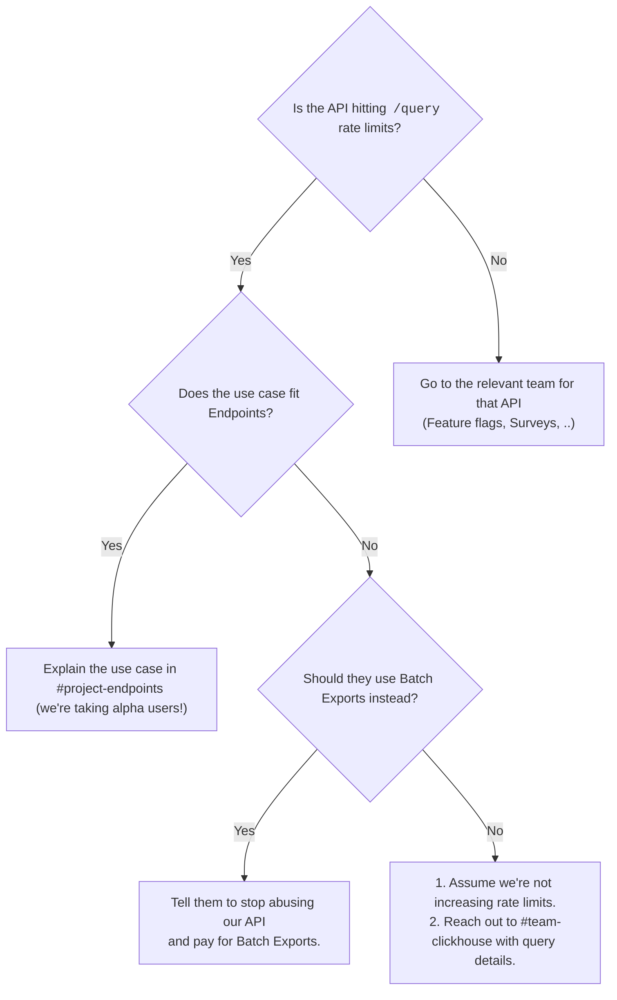

# Request for comments: Clarifying how we handle requests for rate limits & communicating Endpoints project

Our customers are using our API to query their data. Sometimes, regardless of whether the `/query` API endpoint is the appropriate solution to their problem and whether they're abusing it or not, we've had several instances of customers asking for a rate limit increase.

I'll try to clear up some of the confusion on what our stance is on that and who owns answering the question.

First, some context. The `/query` API endpoint is directly sending queries to our ClickHouse. At the moment, although we have some limits in place to derisk, we have little control over what queries get run when and whether they're performant enough to be successfully completed. So if a customer fires of many very slow queries, they will all be run and potentially impact performance of PostHog for other customers. Because of this, we need rate limits.

In the past, we have increased those rate limits for customers who need to use it heavily. This is not the appropriate way to handle this question long term.

Another important element is that we do not charge for API queries at the moment, essentially providing a free data warehouse product. **Every** other data warehouse charges for compute in some shape or form. The other side of that coin is that we can't really start charging today because we can not yet provide the guarantees around reliability and performance. It would be a joy-sucking experience.

So, the long term solution for API queries is to build a reliable and performant way for customers to access their data that we can charge them for the resources that they use. The main push towards that is the `separation of compute and storage` work the data stack team is working on.

ok cool, but.. what is `#project-endpoints`?

Endpoints is:
- a (arguably a poorly named) new product that we're primarily building for B2B2C customers
    - that allows them to *pre-define queries* they will make via the API
        - and allows us to provide them better performance on those queries (since we know what they are ahead of time).

- not a drop-in replacement for the `/query` API that allows any HogQL or Insight query to be executed.
- a product we're aiming at our customers' in-app analytics products (think every Lovable app would have out-of-the-box analytics that runs on Endpoints)

so, where do I go with a customer who's hit a rate limit on the API?

Here's how we'd break down use cases:
- if the use case is exporting all the data so they can do further transformation or activation in other tools -> Batch Exports
- if the use case is ultimately going to be accessing our API programmatically with a pre-defined query -> Endpoints
- if the use case is essentially wrapping PostHog and allowing the customer to query whatever they want -> `/query` API endpoint
    - in other words, if they want a different UI for querying PostHog data
- if they have a product they give their customers and treat us as "managed ClickHouse" - then we may want to know about that 😅

✨ tiny decision tree time ✨

