# Request for comments: RBAC v2 - most-specific access wins

TL;DR: change access control so the most specific rule always applies. 
`organization level < project level < resource permission < object permission`
and
`default level < role override < member override`

## Problem statement

We want access control to support both the **allowlist** and the **denylist** use cases. 

- Allowlist example: a project is private (`No access` by default), and the admin grants specific members/roles access above that.
- Denylist example: a project is open to the org (`Member` by default), but admin wants to exclude a specific role from accessing it without having to set the default to `No access` and then explicitly grant `Member` to everybody else except that one role. 

Access is resolved by `UserAccessControl` through a chain (object → resource → object default), where each rung combines the default, role, and member rules differently. Plus a 4th method to render the effective level in the settings (`get_effective_access_level_for_member`).

- The contractor ("guest") use case isn't supported. We've had repeated requests to share a single object/resource without exposing everything else in the project. This is essentially the allowlist case, where the project default is `No access` with specific resource/object overrides. 
    - First attempt to build this at the middleware level, separate from existing access control, failed. More details here: https://github.com/PostHog/requests-for-comments-internal/blob/main/research/2026-05-01-guest-mode-learnings.md
- The denylist case works for object-level access, but not for resource or project access. 
    - It might block the adoption of new products like Conversations. To give a support agent access to one resource, an org has to buy the Enterprise plan and use RBAC to auto-assign a role on invite that is scoped to just that resource, and set the entire project to `No access` by default. This would be much simpler if you could just set a member's access to resources to `No access` below the default. 
- Agents will have to reason about this. It's hard to figure out what access applies in a given case just from the data in the `ee_accesscontrol` table. We have not yet exposed access control via MCP, but I bet it will be very hard to interpret correctly and configure access rules with the current logic. 

## How it works now

### Case 1 - project default vs role override

Say you want every member you invite into the org to get `Member` access to the project, except the `Contractor` role, which should get `No access`. That's a denylist. 

The old UI didn't let you pick a role/member override of `None` for project access - only `Member` or `Admin`. 

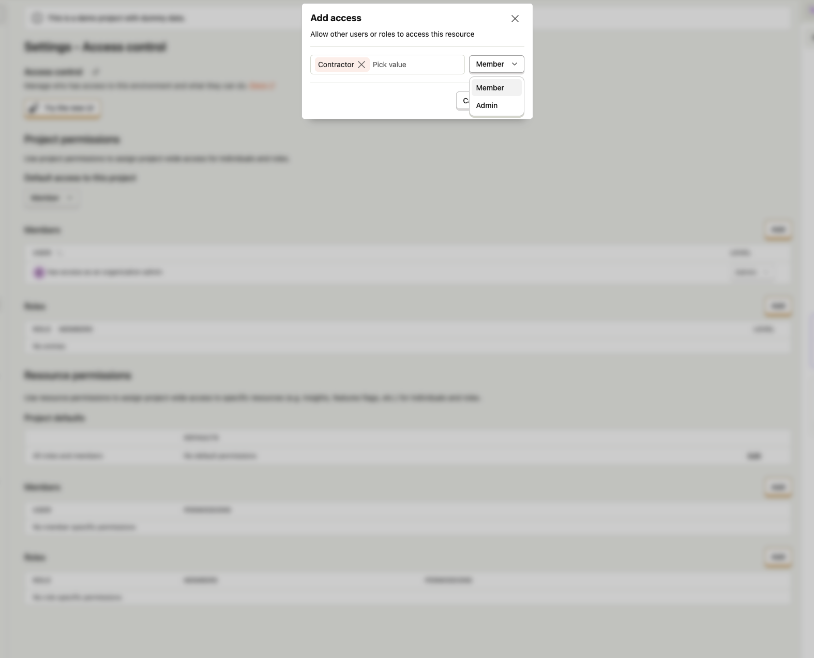

The new UI doesn't support it either, it was built assuming the effective level is `max(default, role, member)`, so it disables every option below the inherited default.

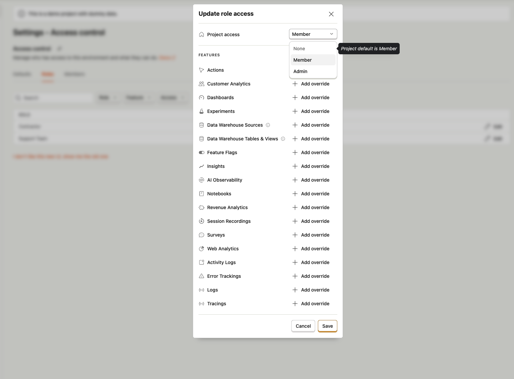

But the API doesn't forbid setting a member's project access to `None` when the project default is `Member`. A project is treated as just another object, so it resolves the same way object access does (`resource=project`, `resource_id=project_id`).

Recently we had a [ticket](https://posthoghelp.zendesk.com/agent/tickets/59200) where a customer had this issue.

_Solution:_ allow selecting role/member project access lower than the default (inherited) level in the new UI.

### Case 2 - object default vs role override

Same as Case 1, but for an object - e.g. a dashboard where everyone has `Viewer` but one role has `No access`.
The API allows that, and the more-specific rule already wins, resolves as `max(role, member)`.

Meanwhile, the UI prevents configuring a role/member override of `No access`, but does allow setting it lower than the object default.
Here's an example:

_Solution:_ allow setting a member/role override to `No access`. This way you don't have to set the dashboard default to `No access` and then explicitly grant every other role `View` access except one.

### Case 3 - project role override vs member override

Say you want to restrict a specific member from accessing the project, the project default is `No access`, and the user is in a role whose project level is `Member`. 

In theory there are two ways to do this:

1 — remove the user from the role (works today), or, if you don't want to remove them from the role (e.g. they're still part of the support team role, but they're an external contractor who shouldn't have project access),

2 - create a member-specific override with project level `No access`. 

The UI doesn't allow configuring the second option, but you can do it via the API. If you do, the more-restrictive member `No access` still wouldn't actually apply, because access is computed as the `max` across all role and member overrides. This contradicts Cases 1 and 2, where the more-specific rule wins.

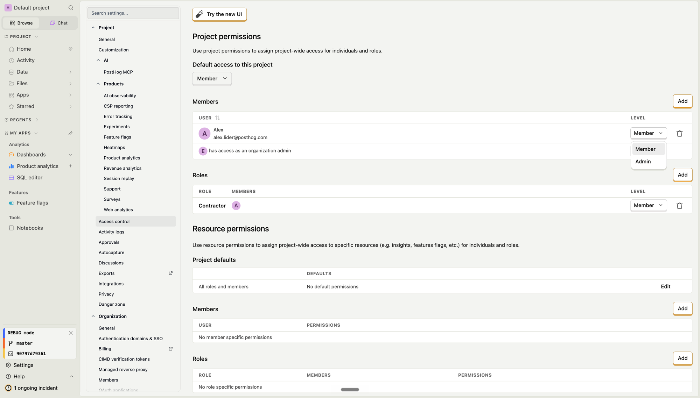

The new UI prevents this too, it assumes an override can't be lower than the inherited default/role access (the max between the default and the roles).

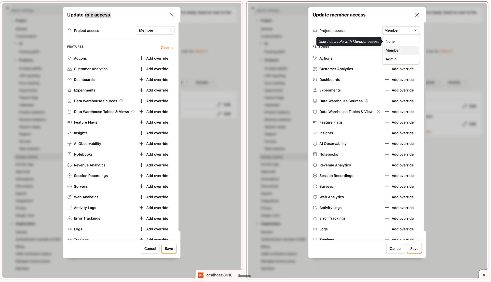

_Solution:_ instead of resolving access as `max(roles, member)`, use the member access if it's set; if not, fall back to the role access (the max across the user's roles); and if that's not set, to the project default.

### Case 4 - resource default vs role override

Say you want all notebooks set to `Viewer`, except one role that should have `No access`. This doesn't work today.

Resource access is resolved as the `max` across the default, role, and member overrides. So the higher `Viewer` default wins and the role still gets `Viewer` (see `access_level_for_resource`). This contradicts the `access_level_for_object` logic, where the more-specific role override wins.

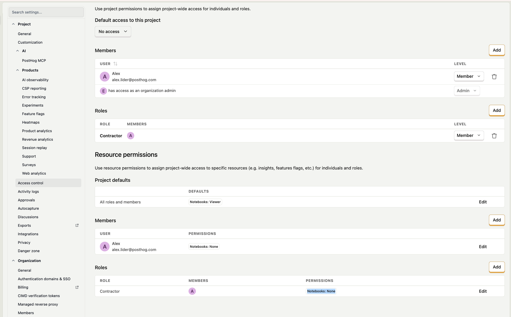
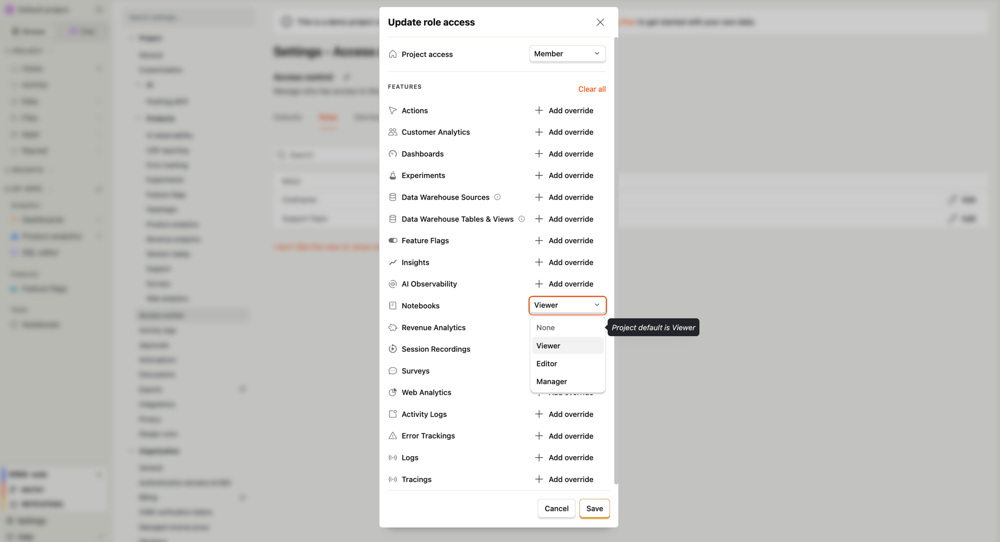

_Solution:_ apply the more-specific access, the same as for Case 3 - use the member override, fall back to `max(roles)`, then to the default.

### Case 5 - resource role override vs member override

Say a role grants `Viewer` on all insights, but you want one member in that role to have `No access`. 
Similar to Case 4, the old UI doesn't prevent setting this, but the member `No access` doesn't apply — resource access is `max(role, member, default)`, so the role's `Viewer` wins.

_Solution:_ apply the more-specific access

### Case 6 - project access vs resource access

Today resource access is separate from project access, the project behaves like another resource that gates access to all other resources when set to `No access`. 

A more-specific resource or object access doesn't apply if user has `No access` to the project. But we don't prevent setting that. 

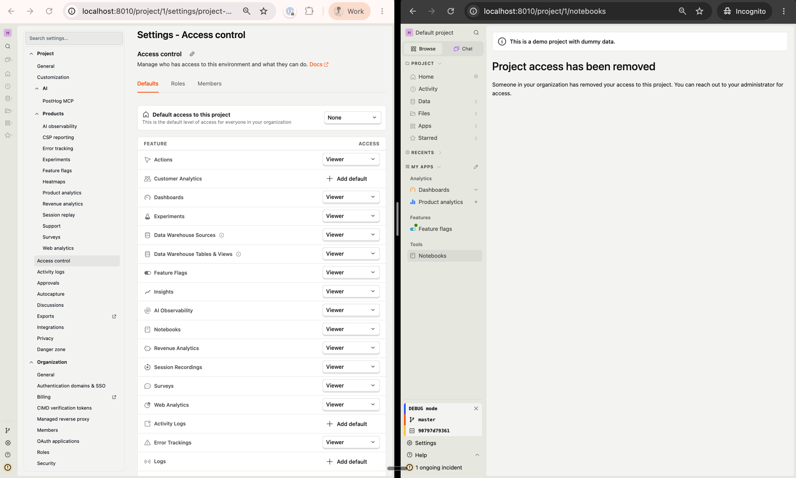

_Solution:_ a more-specific **explicit** resource (or object) grant should apply over the project permission. So if a user has no project access but has an explicit resource/object override of `Viewer` or higher, they should be able to view that resource, even when the project is set to `No access`.This solves the contractor case and lets you share access to just a specific resource or object, without a separate guest mode.

Two things to keep in mind: 
- This should apply only to explicit resource/object overrides, not to the resource fallback (`editor` when there are no overrides). Otherwise every user without project access would see all resources.
- This only affects the case where the project denies access. Nothing changes for a `Member` or `Admin` project default. Granting project `Admin` access still shouldn't give `Manager` resource permission.
- We'll need to notify customers who have projects with a `No access` default and resource overrides that will start applying. There are only 27 orgs and 40 teams affected (Metabase query: https://metabase.prod-us.posthog.dev/question/2114-rbac-projects-with-no-access-resource-defaults).

### Case 7 - project access vs object access

Say you want to share a single dashboard with a member who has no project access — e.g. an external contractor. You grant them `Viewer` on that dashboard, but they still can't see it: `No access` to the project short-circuits everything, so the more-specific object grant never applies. Same as Case 6, but for an object instead of a resource.

The object access settings in the side panel let you select any user in the organization, even members who don't have access to the project. 

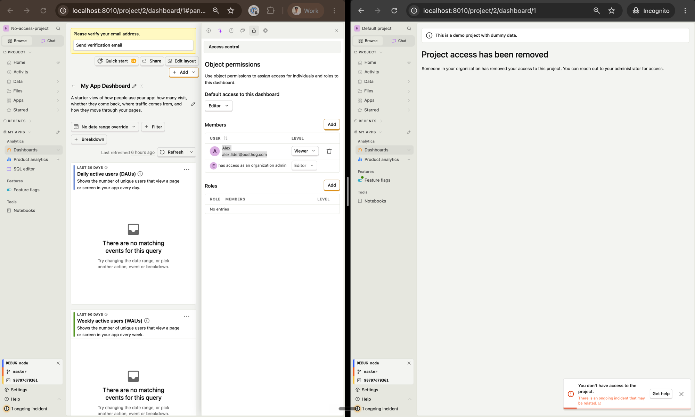

_Solution:_ add a scope dropdown next to the object's default access level (like sharing a doc in Notion / Google Docs) that lets users choose whether the default applies to **everyone in this project** or **everyone in the organization**. Today the default essentially applies to everyone in the project, so adding this option lets us keep the current behavior.

Here's a rough prototype:

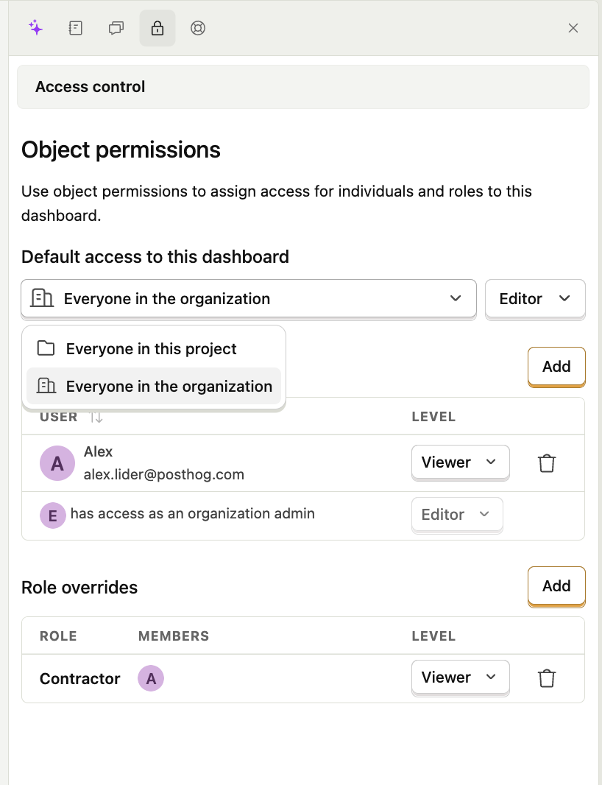

From a data-model perspective, it's enough to add one column like `shared_with = project | organization` to the existing `AccessControl` model (`ee_accesscontrol` table), with a constraint that it only applies to object defaults (rows with `resource` and `resource_id` set, but no `role` or `organization_member`).

Adding this to the existing table also makes it easier for agents to query it via `system.access_controls` in the future, without having to join another table to check whether a user should have access.

## Solution / draft plan

- Update resource access control to use the "more specific wins" rule - member, then `max(roles)`, then default.
- Allow the new access control UI to set Role and Member access for both projects and resources lower than the inherited level (default or role).
- Update object access control to use the same "more specific wins" rule.
- Add a new `shared_with` field for the default object access and migrate existing resources to `shared_with=project`.
    - Add the new `shared_with` dropdown to object access settings in the side panel.
- Make a specific object access apply when the user has no access to the project.
- Make a specific resource permission apply when the user has no access to the project.

The main risk is existing access control rules that are configured but don't apply and after the change they'll widen someone's access. 
- Resource overrides will grant access regardless of a `No access` project.
- Object overrides that don't apply when project access is set to `None`. We could migrate existing defaults as shared with the project and add a warning on member/role overrides that this is an external member.
Not many customers have these, so we can manually reach out before switching them to the new logic.

Using more-specific access over additive rules is somewhat controversial, but I think it fits the PostHog model better, where an org has many projects and resources and users want to be able to both share and restrict a specific resource or object. 

### Alternative solutions that I rejected

Instead of making everything most-specific, make everything like the resource access control where `effective = max(project default, role override, member override)` for projects and objects too. This is simpler and additive, but it **loses the denylist** — you wouldn't be able to set a member's object override lower than the object default.

It would also make the current configuration for some customers more permissive. If there's an existing project override for a member set to `No access` while the default project access is `Viewer` (set via the API, for example), `max` would grant them access, which could be unexpected.

### How others do this

**Notion:**

Access control is additive (it only supports the allowlist use case). For example, if a page is shared with anyone who has the link at "Editor" access, and a specific user already has access set to "Viewer", then "Editor" is actually applied (with a warning icon).

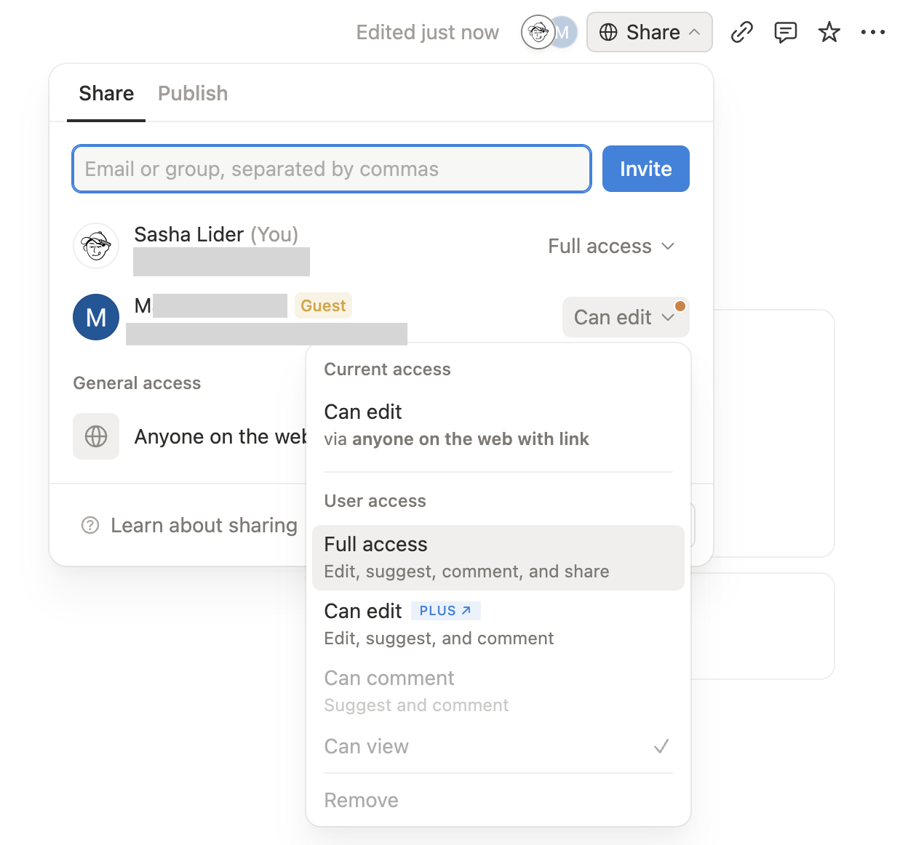

**Google:**

In the Workspace Admin Console you can turn  on/off  access to services (Gmail, Drive, Calendar, ...) for Groups and Organizational Units, and individual access inherits from those.

There's no per-product "resource default", for example google docs are private to the creator, and each doc has its own "General access" setting that lets you share it with specific users, groups or the entire org.
If you share access with anyone in the org, you can't restrict access for specific users (the max across the doc's share settings applies).

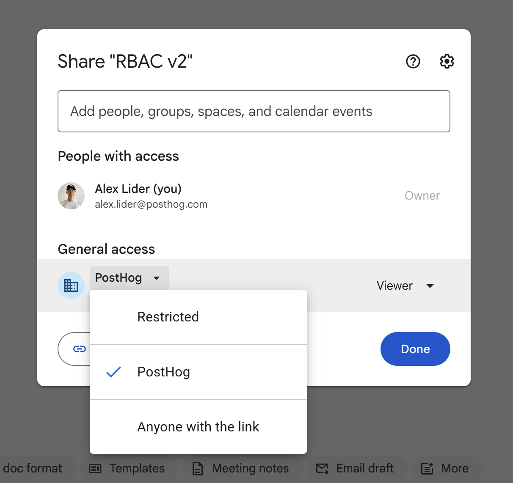